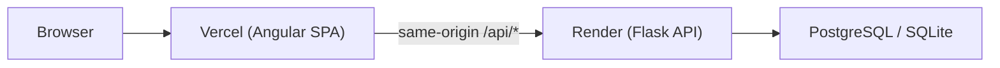

# StarLight — Share Your Stories with the Universe

**"Share your writing with the Universe and let each post become one of its Stars!"**

A modern blogging platform inspired by Medium, built with Angular and Flask. Writers can publish stories, explore communities, follow authors, bookmark articles, and engage through comments and likes.

<div align="center">
  
</div>

**Live app:** [starlight-blog.vercel.app](https://starlight-blog.vercel.app)  
**API:** [starlight-api-njt0.onrender.com](https://starlight-api-njt0.onrender.com)

---

## Features

### Publishing & reading
- Rich text editor (self-hosted TinyMCE) on write/edit routes
- Slug-based article URLs (`/post/:slug`)
- Paginated explore feed with sorting (newest, oldest, likes, alphabetical)
- Author profiles (`/author/:username`) with follow support
- Full-text search and community filtering
- Bookmarks, reading progress bar, and share-to-clipboard
- RSS feed at `/api/feed/rss`

### Community & engagement
- Topic communities with labeled posts
- Comments (create, edit, delete) with author permissions
- Like/unlike posts with duplicate-like protection
- Platform stats and trending posts on the homepage

### UX & design
- Dark mode toggle with persisted theme preference
- Medium-style post cards and article reader layout
- Responsive layout for desktop and mobile
- Glassmorphism-inspired UI with gradient branding

### Security & reliability
- Session-based authentication (httpOnly cookies via API proxy)
- Token-based password reset (signed, expiring links — no exposed user IDs)
- HTML sanitization on post content (Bleach + Angular `DomSanitizer`)
- Rate limiting on auth and search endpoints
- CORS allowlist for production origins
- GitHub Actions CI (frontend build, TypeScript check, backend tests)

---

## Screenshots

<p align="center">
  
  <br>
  <em>Homepage — landing page with platform stats and trending stories</em>
</p>

<p align="center">
  
  <br>
  <em>Explore — paginated feed with sort controls and post cards</em>
</p>

---

## Quick Start (Local Development)

### Prerequisites

- Node.js 18+ (20 recommended)
- Python 3.11+
- npm and pip

### 1. Clone the repository

```bash
git clone https://github.com/mangeshraut712/Starlight-Blogging-Website.git
cd Starlight-Blogging-Website
```

### 2. Backend

```bash
cd starlight-backend
python3 -m venv .venv
source .venv/bin/activate   # Windows: .venv\Scripts\activate
pip install -r requirements.txt
cp .env.example .env        # edit values as needed
python app.py
```

Backend runs at **http://localhost:8080**

### 3. Frontend

In a second terminal:

```bash
cd starlight-ng
npm install
npm start
```

Frontend runs at **http://localhost:4200** and proxies `/api` to the backend via `proxy.conf.json`.

---

## Project Structure

```
Starlight-Blogging-Website/
├── .github/workflows/          # CI (build, typecheck, backend tests)
├── starlight-backend/          # Flask API
│   ├── app.py                  # Routes, auth, rate limits
│   ├── models.py               # User, Post, Comment, Like, Bookmark, Follow
│   ├── sanitize.py             # HTML sanitization (Bleach)
│   ├── utils.py                # Slugs, excerpts, usernames
│   ├── schema_migrate.py       # Runtime schema patches (dev/bootstrap)
│   ├── tests/                  # pytest (sanitization, etc.)
│   ├── migrations/             # Alembic migrations
│   ├── requirements.txt
│   └── Procfile                # Gunicorn for Render
├── starlight-ng/               # Angular 15 frontend
│   ├── src/app/
│   │   ├── components/         # navbar, post-cart, pop-up
│   │   ├── pages/              # homepage, explore, post-detail, author, search, …
│   │   ├── services/           # auth, post, user, theme, meta
│   │   └── utils/api-url.ts    # Production-safe API base URL
│   ├── vercel.json             # SPA rewrites + /api proxy to Render
│   └── angular.json
├── render.yaml                 # Render blueprint (API + Postgres)
└── README.md
```

---

## Architecture



In production, the Vercel frontend rewrites `/api/*` to the Render backend so session cookies work same-origin. In development, the Angular dev server proxies to `localhost:8080`.

---

## Tech Stack

| Layer | Technologies |
|-------|----------------|
| **Frontend** | Angular 15, TypeScript, RxJS, Bootstrap 5, Angular Material (dialogs/snackbar), TinyMCE (self-hosted) |
| **Backend** | Flask 3, SQLAlchemy, Flask-Migrate, Flask-Limiter, Bleach, Gunicorn |
| **Database** | PostgreSQL (Render production), SQLite (local dev) |
| **Deploy** | Vercel (frontend), Render (API), GitHub Actions (CI) |

---

## Environment Variables

### Backend (`starlight-backend/.env`)

| Variable | Description |
|----------|-------------|
| `SECRET_KEY` | Flask session signing key (**required in production**) |
| `DATABASE_URL` | `sqlite:///starlight.db` locally; Postgres URL on Render |
| `FLASK_ENV` | `development` or `production` |
| `ALLOWED_ORIGINS` | Comma-separated CORS origins (e.g. `http://localhost:4200`) |
| `PORT` | Server port (default `8080`) |
| `RUN_SCHEMA_PATCH` | Set to `false` to skip runtime schema patches (default `true`) |

### Frontend (`starlight-ng/src/environments/`)

| File | `apiUrl` | Purpose |
|------|----------|---------|
| `environment.ts` | `http://localhost:8080` | Local dev |
| `environment.prod.ts` | `''` (empty) | Production — uses same-origin `/api` via Vercel proxy |

---

## API Overview

### Authentication
| Method | Endpoint | Description |
|--------|----------|-------------|
| POST | `/api/login` | Login (session cookie) |
| POST | `/api/register` | Register new user |
| GET | `/api/logout` | End session |
| GET | `/api/current_user` | Current user profile |
| POST | `/api/forgot_password` | Request password reset (generic response) |
| POST | `/api/reset_password` | Reset with signed `token` |

### Posts & discovery
| Method | Endpoint | Description |
|--------|----------|-------------|
| GET | `/api/posts` | List posts (pagination, sort, label filter) |
| GET | `/api/posts/slug/:slug` | Post by slug |
| POST | `/api/new-post` | Create post (auth) |
| PUT | `/api/update-post/:id` | Update post (author only) |
| DELETE | `/api/delete-post/:id` | Delete post (author only) |
| GET | `/api/search` | Search by query and/or community |
| GET | `/api/trending` | Trending posts |
| GET | `/api/stats` | Platform statistics |
| GET | `/api/feed/rss` | RSS feed |

### Engagement & social
| Method | Endpoint | Description |
|--------|----------|-------------|
| POST/DELETE | `/api/posts/:id/like` | Toggle like |
| GET/POST | `/api/posts/:id/comments` | List / add comments |
| POST/DELETE | `/api/posts/:id/bookmark` | Toggle bookmark |
| GET | `/api/bookmarks` | User's saved posts |
| POST/DELETE | `/api/users/:id/follow` | Follow / unfollow author |
| GET | `/api/authors/:username` | Author profile |
| GET | `/api/authors/:username/posts` | Author's published posts |

### Health
| Method | Endpoint | Description |
|--------|----------|-------------|
| GET | `/api/health` | Health check (includes DB probe) |

---

## Deployment

### Frontend (Vercel)

The `starlight-ng/` directory is deployed to Vercel. `vercel.json` rewrites `/api/*` to the Render backend.

```bash
cd starlight-ng
npx vercel --prod
```

### Backend (Render)

Configured via `render.yaml` at the repo root. Render runs Gunicorn with `healthCheckPath: /api/health`.

After pushing to `main`, trigger a redeploy if auto-deploy is not enabled:

```bash
render deploys create <service-id> --confirm
```

### CI (GitHub Actions)

On every push to `main` / `develop` and on PRs:

- **Frontend:** `npm ci` → production build → `tsc --noEmit`
- **Backend:** venv → `pip install` → Flask import check → `pytest` → syntax check

---

## Scripts

### Frontend (`starlight-ng/`)

```bash
npm start          # Dev server on :4200
npm run build:prod # Production build
```

### Backend (`starlight-backend/`)

```bash
python app.py                          # Dev server
gunicorn --bind 0.0.0.0:8080 app:app   # Production-style local run
pytest tests/ -q                       # Run tests
```

---

## Troubleshooting

### Explore shows no posts in production

Ensure the frontend uses an empty `apiUrl` in `environment.prod.ts` and that Vercel rewrites `/api` to Render. Requests must **not** go to `localhost:8080`.

### CORS / session issues locally

- Frontend must use `withCredentials: true` (already set in services)
- Backend `ALLOWED_ORIGINS` must include `http://localhost:4200`
- Use the Angular proxy (`npm start`), not a mismatched API URL

### Backend won't start in production

`SECRET_KEY` is required when `FLASK_ENV=production`. Render generates this automatically via `render.yaml`.

### Reset password in development

`POST /api/forgot_password` returns a `reset_token` in non-production responses. Use it at `/change-password?token=...`. In production, wire an email service to deliver reset links.

---

## Roadmap

- [x] Dark mode
- [x] Slug URLs, author profiles, bookmarks, follows
- [x] Search, RSS, trending, platform stats
- [x] GitHub Actions CI
- [x] Vercel + Render deployment
- [ ] Email delivery for password reset
- [ ] Draft / publish workflow
- [ ] Cover image upload (S3 / Cloudinary)
- [ ] Angular SSR or prerender for SEO
- [ ] Full Alembic migrations (replace runtime schema patches)
- [ ] Playwright E2E tests in CI

---

## Contributing

```bash
git checkout -b feature/your-feature
# make changes, ensure CI passes locally
git commit -m "Describe your change"
git push origin feature/your-feature
# open a Pull Request
```

---

## License

MIT License — see repository for details.

---

<div align="center">

**[Visit StarLight](https://starlight-blog.vercel.app)** · [GitHub](https://github.com/mangeshraut712/Starlight-Blogging-Website)

Built with care for writers who want reach.

</div>
